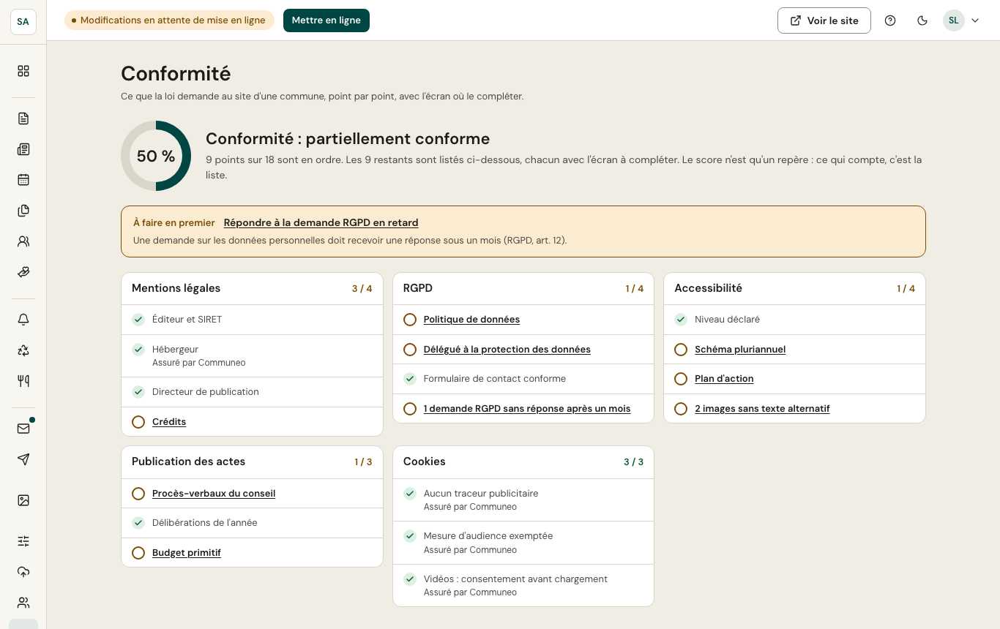

L'écran liste les **obligations** d'un site de commune (mentions légales, données personnelles, accessibilité, cookies, informations publiques…), regroupées par catégorie. Chaque point indique s'il est rempli et, sinon, **ce qu'il reste à faire** et l'écran où le compléter.

Certains points sont **garantis par la plateforme** (pas de traceur sans consentement, site en HTTPS, hébergement en France…) et apparaissent comme remplis.
