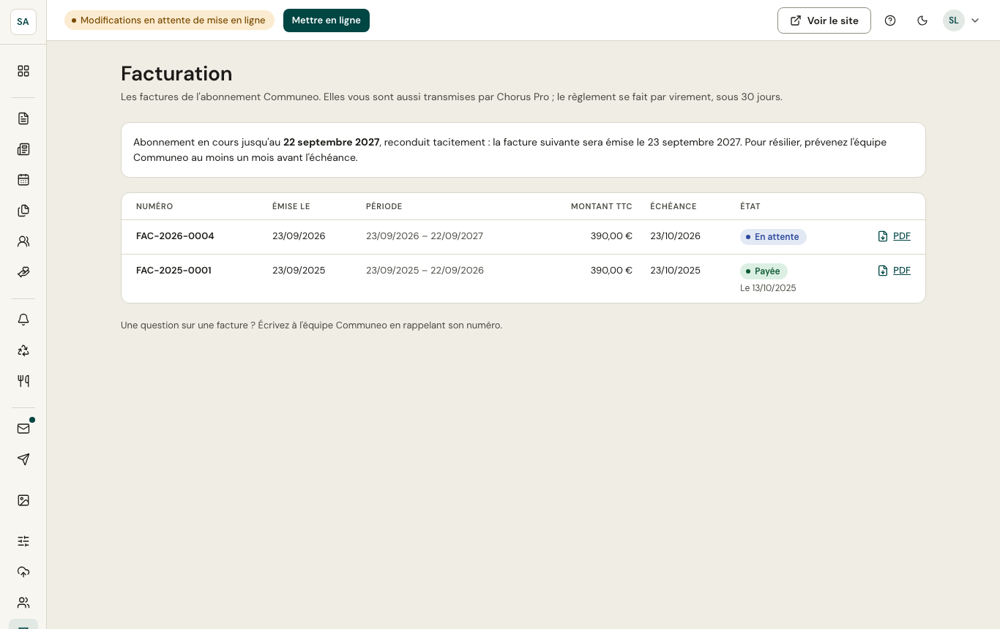

L'écran **Facturation** (administrateurs de la commune) liste les factures de l'abonnement Communeo, de la plus récente à la plus ancienne, avec leur période, leur montant, leur échéance et leur état : **en attente**, **en retard**, **payée**, **annulée** ou **avoir**. Chaque document s'ouvre en PDF.

- La **première facture** est émise au passage en live, d'après le devis validé ; les suivantes, chaque année à l'échéance (l'abonnement est reconduit tacitement).
- Chaque facture vous est **envoyée par e-mail** (à l'adresse de facturation du devis et aux administrateurs) et **transmise par Chorus Pro**.
- Le **règlement se fait par virement** sous 30 jours, sur l'IBAN indiqué sur la facture, en rappelant son numéro. Un rappel est envoyé 7 puis 30 jours après l'échéance si le paiement n'est pas arrivé.
- Une facture n'est jamais modifiée : en cas d'erreur, elle est annulée par un **avoir**, puis une nouvelle facture est émise.
- Pour **résilier**, prévenez l'équipe Communeo au moins un mois avant l'échéance : aucune nouvelle facture ne sera émise.
