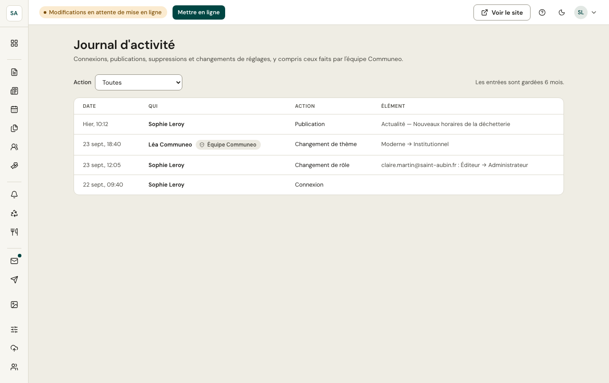

Le journal garde la trace des actions importantes pendant **six mois** : connexions, publications, suppressions, changements d'utilisateurs, changement de thème. Il se filtre par type d'action. Les administrateurs de la commune le consultent ; les actions faites par l'équipe Communeo y sont signalées.
