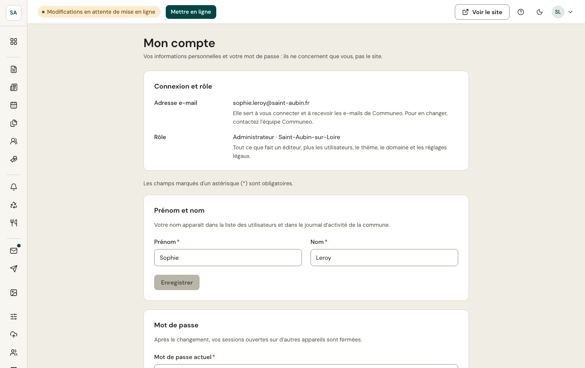

Le menu de votre compte, en haut à droite de chaque écran (sur téléphone : votre avatar), mène à **Mon compte** et permet de se déconnecter. Tout ce que vous changez ici ne concerne que vous, pas le site de la commune.

## Connexion et rôle

- **Adresse e-mail** : elle sert à vous connecter et à recevoir les e-mails de Communeo. Elle ne se change pas depuis cet écran : pour en utiliser une autre, contactez l'équipe Communeo.
- **Rôle** : administrateur ou éditeur, et la commune. Seul un administrateur de la commune peut changer un rôle, depuis l'écran [Utilisateurs](/administration/utilisateurs/).

## Prénom et nom

Votre nom apparaît dans la liste des utilisateurs et dans le [journal d'activité](/administration/journal/). Modifiez-le puis cliquez sur **Enregistrer**.

## Mot de passe

1. Saisissez votre **mot de passe actuel**.
2. Choisissez le **nouveau mot de passe** : 10 caractères au moins, différent de l'actuel. Plusieurs mots faciles à retenir font un bon mot de passe ; l'indicateur sous le champ dit s'il est robuste.
3. Confirmez-le, puis cliquez sur **Changer le mot de passe**.

Vous restez connecté sur cet appareil ; vos sessions ouvertes ailleurs (un autre ordinateur, un téléphone) sont fermées, et un e-mail vous prévient du changement. Si vous ne l'avez pas demandé, choisissez tout de suite un nouveau mot de passe avec **Mot de passe oublié** sur la page de connexion.

Après 5 mots de passe actuels erronés, le compte est bloqué 15 minutes, comme à la connexion.

**Mot de passe actuel oublié ?** Le lien sous le formulaire vous envoie un e-mail pour en choisir un nouveau (lien valable 1 heure).
