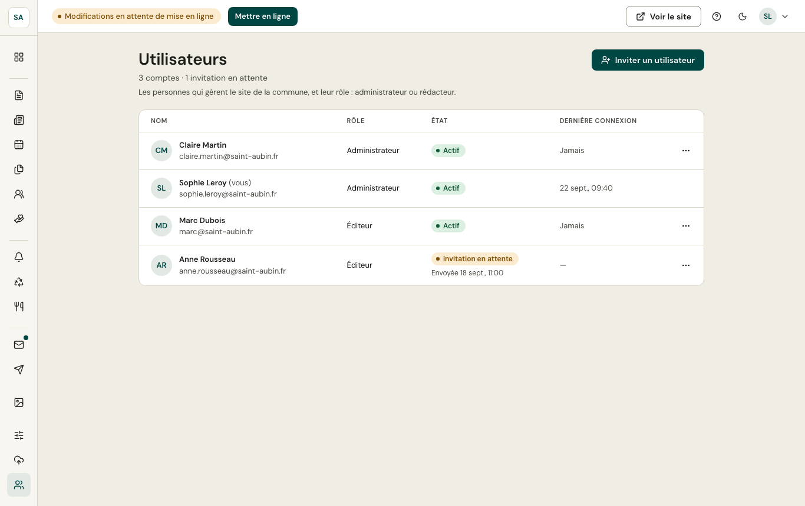

*Réservé aux administrateurs.* L'écran liste les comptes de la commune, leur **rôle** et leur **dernière connexion**.

- **Inviter** une personne : elle reçoit un e-mail pour choisir son mot de passe.
- **Rôle** : administrateur (tout) ou rédacteur (contenus, vie pratique, messages, médiathèque).
- **Désactiver** un compte le bloque immédiatement sans le supprimer. La commune garde toujours au moins un administrateur actif, et personne ne peut désactiver son propre compte.
