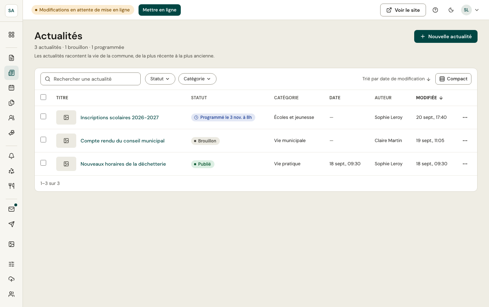

Les actualités racontent la vie de la commune, de la plus récente à la plus ancienne. Elles s'écrivent dans l'[éditeur](/publier/editeur/) avec :

- une **catégorie** (vie municipale, travaux, vie pratique, écoles et jeunesse, culture et loisirs, associations, environnement, santé et solidarité), qui sert de filtre sur le site ;
- **Mettre à la une sur la page d'accueil** pour la placer en premier dans les actualités de l'accueil ;
- un **chapô**, repris dans la liste des actualités et sur l'accueil ;
- une **date de publication affichée** (vide : la date de la première publication) et un **auteur** (personne ou service), facultatifs.
