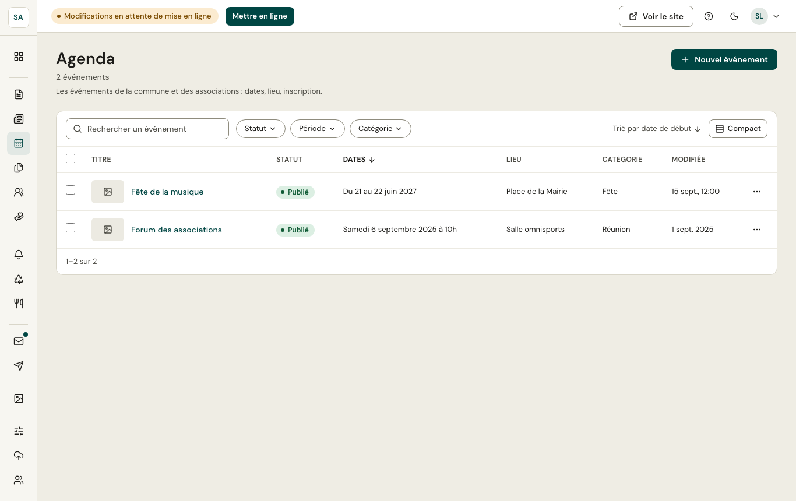
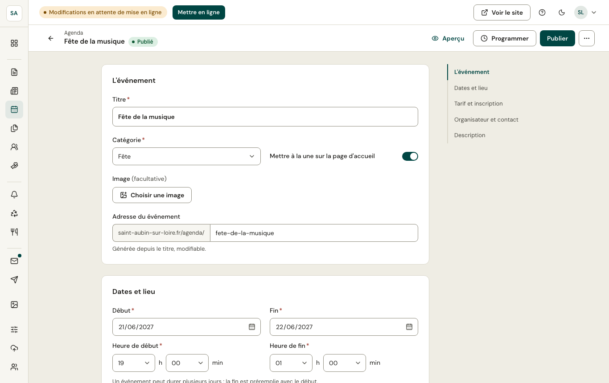

L'agenda réunit les événements de la commune et des associations. Un événement passé disparaît de l'agenda du site ; il reste consultable dans l'administration.

Un événement précise :

- les **dates et horaires** (début et fin, sur une ou plusieurs journées) ;
- le **lieu** et son adresse ;
- le **tarif** et l'**inscription** (obligatoire ou conseillée, date limite, nombre de places) ;
- l'**organisateur** et ses coordonnées ;
- une **catégorie** (fête, culture, sport, réunion, atelier…).

Sur le site, chaque événement propose **Ajouter à mon agenda** (fichier .ics).
