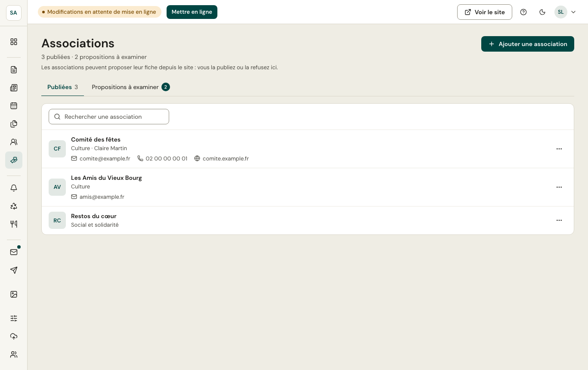
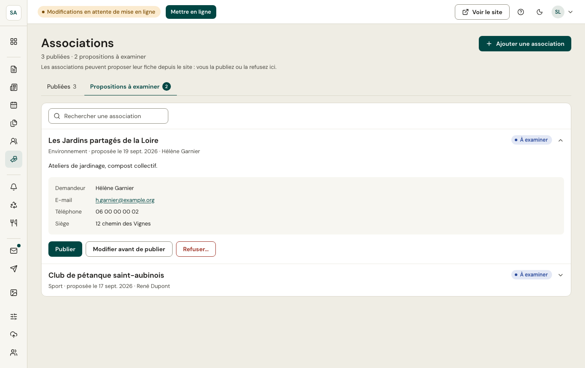

L'annuaire des associations paraît sur le site, filtrable par catégorie (sport, culture, éducation et jeunesse, social et solidarité…).

## Propositions

Une association peut **proposer sa fiche** depuis le site. La proposition arrive dans l'onglet **Propositions** : vous la **publiez** (elle rejoint l'annuaire) ou la **refusez**.
