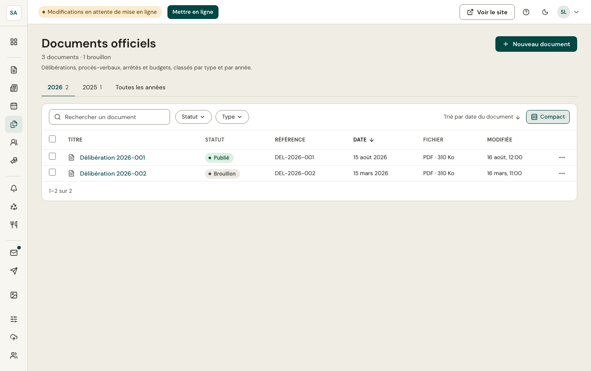
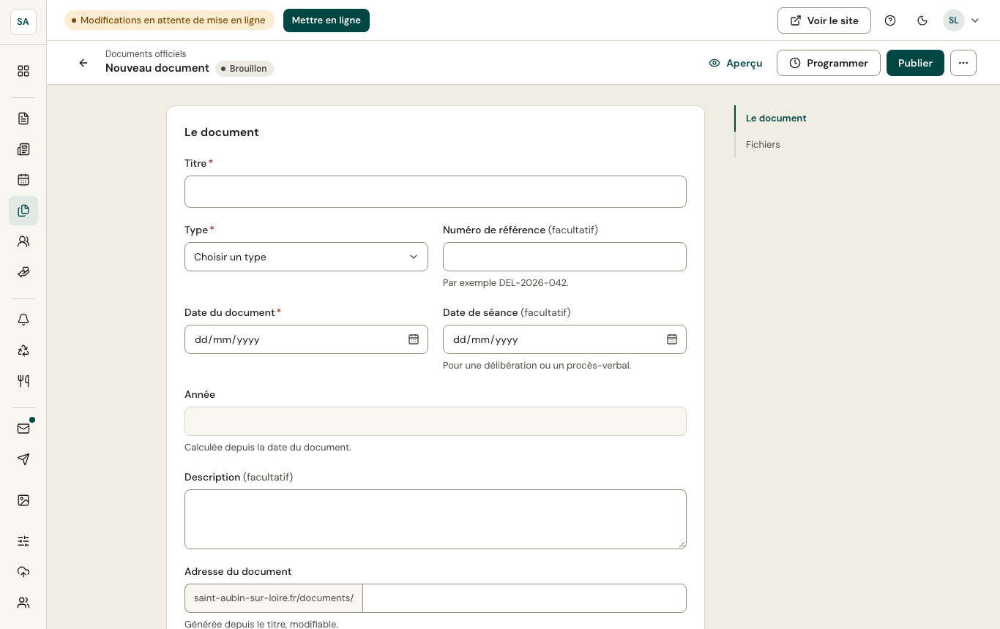

Les documents officiels sont classés **par année** (onglets) et **par type** : procès-verbal de conseil municipal, délibération, arrêté, budget primitif, compte administratif, rapport d'orientations budgétaires, documents d'urbanisme…

## Ajouter un document

**Nouveau document** : titre, type, référence (ex. `DEL-2026-031`), date du document et, pour un conseil, date de la séance, puis le **fichier** (PDF de préférence). Des annexes peuvent être jointes.

Sur le site, la page Documents officiels permet de chercher par mot-clé, type et année.

:::tip
Publiez vos documents en PDF **balisé** (accessible) : les logiciels de bureautique le proposent à l'enregistrement.
:::
