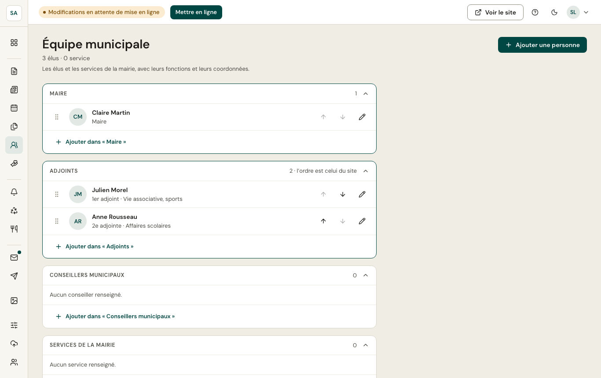

L'équipe est organisée en groupes : **maire**, **adjoints**, **conseillers municipaux**, **services de la mairie**. Chaque personne a une fonction, et selon le cas une délégation, une photo, un e-mail, des permanences.

- **Ajouter dans « … »** ajoute une personne au groupe ; un panneau latéral s'ouvre pour sa fiche.
- L'ordre se change avec les flèches (ou en glissant).
- Les changements sont **enregistrés immédiatement** et paraissent sur le site à la prochaine mise en ligne.
