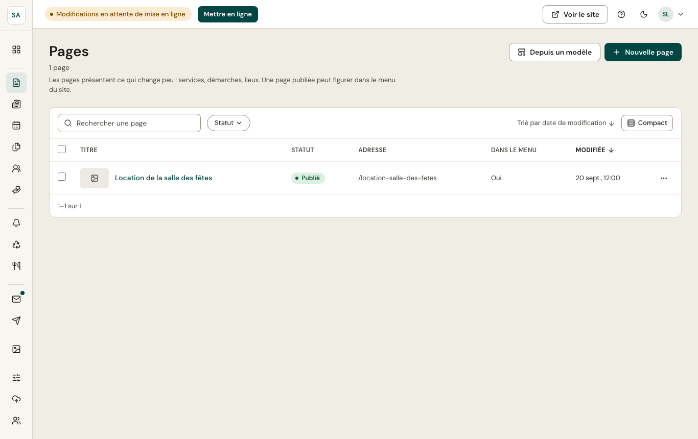
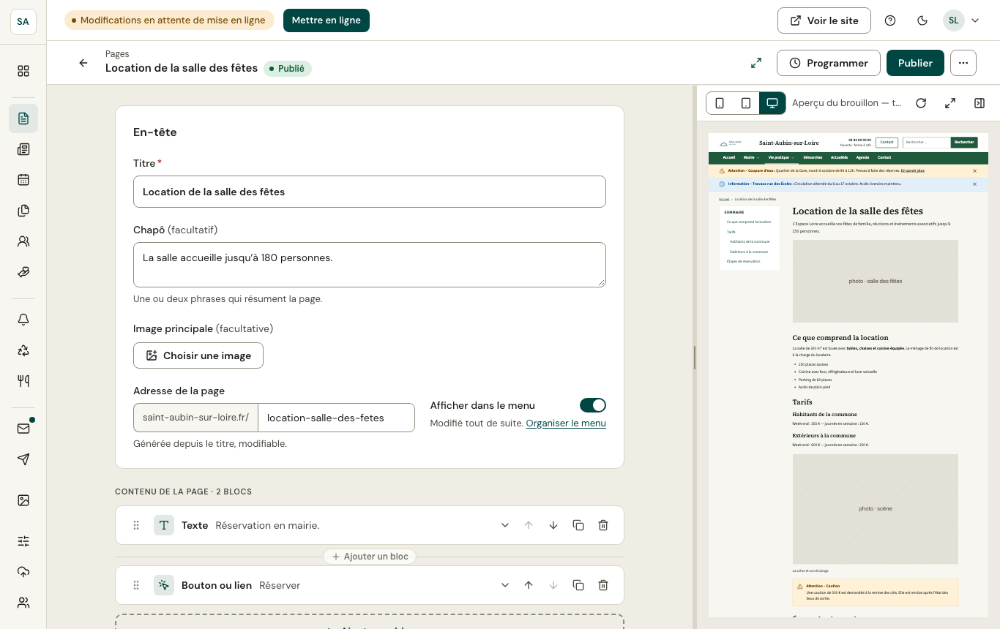

Les pages présentent ce qui change peu : services de la mairie, démarches, lieux (salle des fêtes, médiathèque…). Une page publiée peut figurer dans le [menu du site](/mon-site/menu/).

## La liste

- **Rechercher**, filtrer par **statut** (brouillon, publié, modifié, programmé), trier par colonne.
- **Compact** resserre les lignes pour les longues listes.
- Cochez plusieurs lignes pour agir en une fois ; le menu **⋯** d'une ligne propose les actions de cette page.

## Créer une page

- **Nouvelle page** ouvre l'[éditeur](/publier/editeur/) sur une page vide.
- **Depuis un modèle** propose des pages types (état civil, urbanisme, salle des fêtes…) déjà structurées, à compléter.

Dans l'éditeur, **Afficher dans le menu** ajoute la page publiée au menu du site ; l'ordre se règle dans [Menu du site](/mon-site/menu/).
