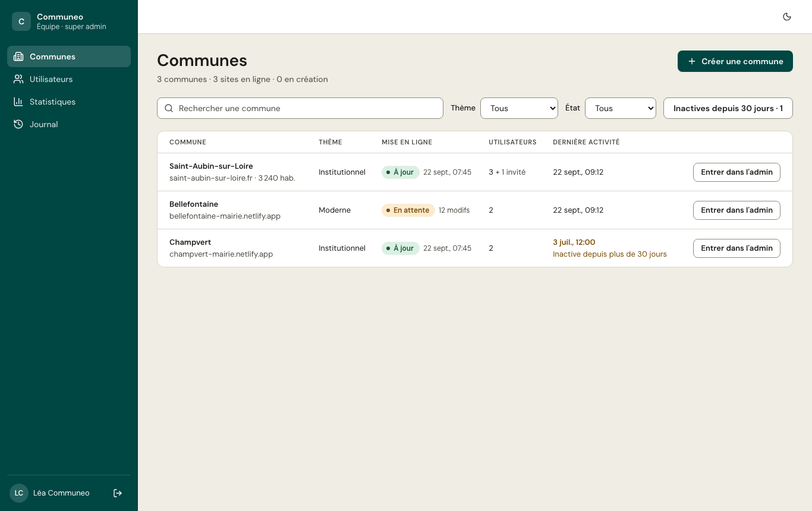
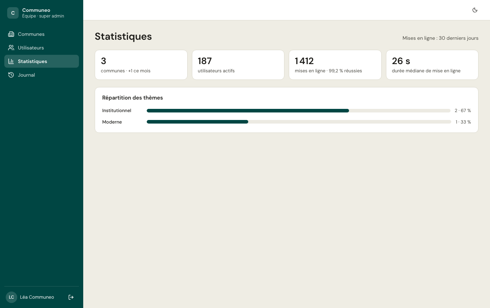

*Réservé à l'équipe Communeo.* L'espace **Plateforme** gère toutes les communes.

- **Communes** : créer une commune (l'administrateur reçoit une invitation et arrive dans l'[assistant](/premiers-pas/assistant/)), consulter sa fiche, **suspendre** une commune (ses utilisateurs ne peuvent plus se connecter, plus aucune mise en ligne).
- **À valider** : les inscriptions dont la mairie n'a pas d'adresse dans l'Annuaire (vérifiez auprès de la mairie que la demande vient bien d'elle) et les passages en live demandés, avec le devis validé par la commune (PDF). **Valider…** crée la commune en essai et invite le demandeur, ou passe la commune en live ; **Refuser…** envoie un motif par e-mail. Le compteur de la navigation indique ce qui attend. L'équipe reçoit aussi un e-mail à chaque nouvelle commune en essai, inscription à vérifier et demande de passage en live.
- **Période d'essai** : la liste signale les communes en essai (jours restants), à l'essai terminé ou qui ont demandé le passage en live ; l'équipe reçoit un e-mail à chaque demande. Sur la fiche, **Passer en live…** termine l'essai (un site retiré est remis en ligne) et **Prolonger l'essai…** ajoute 7, 15 ou 30 jours. Une commune créée par l'équipe est en live d'emblée.
- **Ouvrir l'administration** d'une commune pour l'aider : les actions faites ainsi sont signalées dans son journal.
- **Utilisateurs** de toutes les communes, **statistiques** et **journal** de la plateforme.

