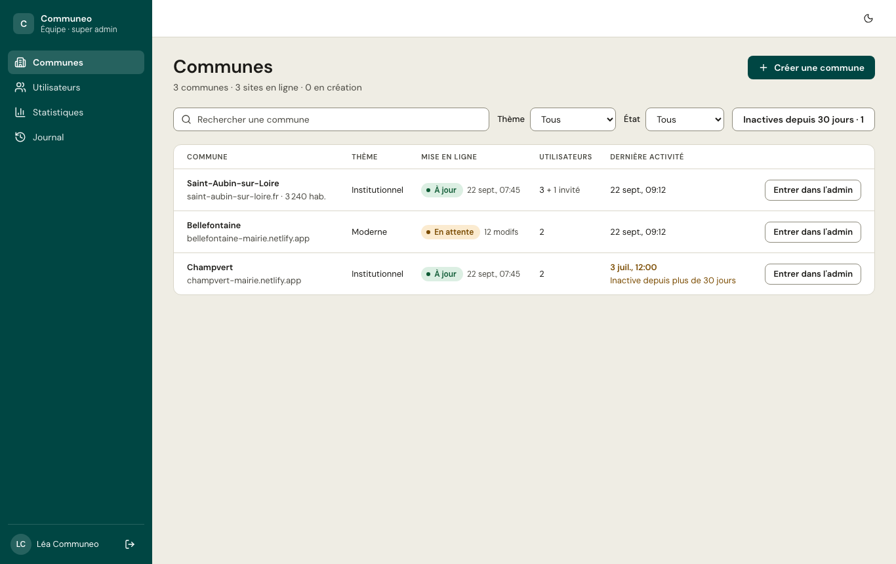
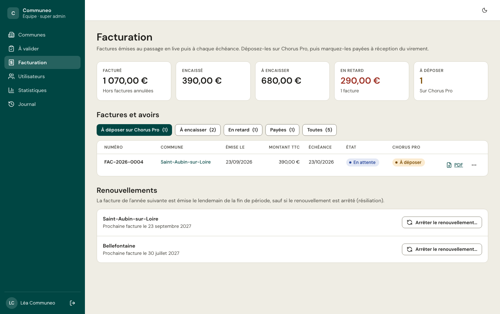
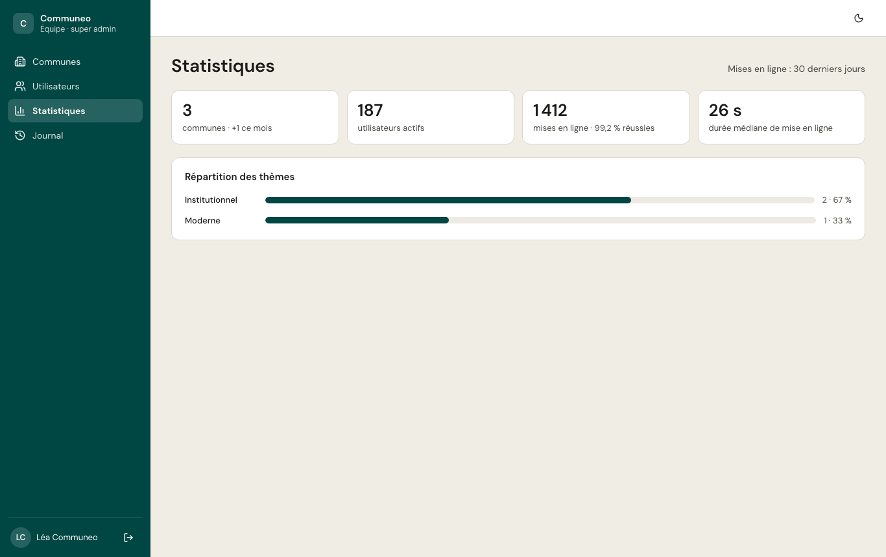

*Réservé à l'équipe Communeo.* L'espace **Plateforme** gère toutes les communes.

- **Communes** : créer une commune (l'administrateur reçoit une invitation et arrive dans l'[assistant](/premiers-pas/assistant/)), consulter sa fiche, **suspendre** une commune (ses utilisateurs ne peuvent plus se connecter, plus aucune mise en ligne).
- **À valider** : les inscriptions pas encore approuvées et les passages en live demandés, avec le devis validé par la commune (PDF). Une commune inscrite prépare déjà son site, mais rien n'est mis en ligne avant l'approbation : sans adresse de mairie dans l'Annuaire, c'est à l'équipe de vérifier ; sinon la mairie n'a pas encore répondu à l'e-mail envoyé à son adresse officielle, et l'équipe peut approuver à sa place après l'avoir contactée. **Valider…** approuve l'inscription (le site peut être mis en ligne) ou passe la commune en live ; **Refuser…** envoie un motif par e-mail et, pour une inscription, supprime la commune commencée. Le compteur de la navigation indique ce qui attend. L'équipe reçoit aussi un e-mail à chaque nouvelle commune en essai, inscription à vérifier, réponse d'une mairie et demande de passage en live.

- **Facturation** : les factures sont émises automatiquement au passage en live (montant du devis accepté), puis à chaque échéance annuelle. L'écran montre ce qui est **facturé**, **encaissé**, **à encaisser**, **en retard** et **à déposer sur Chorus Pro**. Pour chaque facture : **Déposée sur Chorus Pro…** (date, numéro de flux), **Marquer payée…** à réception du virement (date, montant), **Relancer la commune…**, **Annuler par un avoir…** (motif obligatoire, l'avoir est envoyé à la commune). Les relances partent seules 7 et 30 jours après l'échéance ; la dernière prévient l'équipe par e-mail. Une commune qui résilie : **Arrêter le renouvellement…**. Une commune passée en live sans facture apparaît en tête de l'écran. Les coordonnées de Communeo (dont l'IBAN) viennent des variables `COMMUNEO_*` du serveur ; s'il en manque, l'écran le signale.
- **Référencement** : sur la fiche d'une commune en live, **Vérification Google Search Console** reçoit le code de la méthode « Balise HTML » (ou la balise entière) ; il est posé sur le site à la prochaine mise en ligne, et l'équipe suit le référencement depuis son propre compte Search Console, sans que la commune touche à son DNS. Le reste est automatique : titre « Mairie de … – site officiel », descriptions, image de partage aux couleurs du thème, plan du site.
- **Période d'essai** : la liste signale les communes en essai (jours restants), à l'essai terminé ou qui ont demandé le passage en live ; l'équipe reçoit un e-mail à chaque demande. Sur la fiche, **Passer en live…** termine l'essai (un site retiré est remis en ligne) et **Prolonger l'essai…** ajoute 7, 15 ou 30 jours. Une commune créée par l'équipe est en live d'emblée.
- **Ouvrir l'administration** d'une commune pour l'aider : les actions faites ainsi sont signalées dans son journal.
- **Utilisateurs** de toutes les communes, **statistiques** et **journal** de la plateforme.

