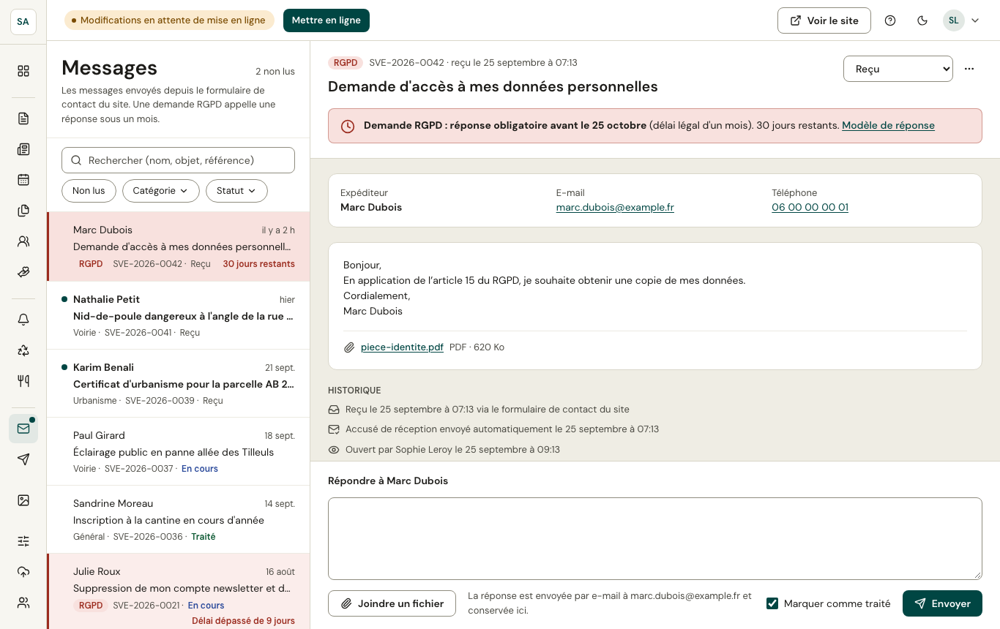

Les messages envoyés depuis le formulaire de contact du site arrivent ici. L'expéditeur reçoit automatiquement un **accusé de réception** avec une référence (`SVE-2026-0042`).

- La liste se filtre : **non lus**, **catégorie**, **statut** (reçu, en cours, traité).
- Le message s'affiche à droite, avec ses pièces jointes et son **historique** (reçu, accusé envoyé, ouvert par…).
- **Répondre** envoie la réponse par e-mail à l'expéditeur et la conserve ici ; **Marquer comme traité** clôt la demande.

## Demandes RGPD

Une demande sur les données personnelles (accès, rectification, effacement) doit recevoir une réponse **sous un mois**. Elle est signalée en rouge avec le **nombre de jours restants**, et un **modèle de réponse** est proposé. Une demande en retard apparaît comme prochaine action sur le tableau de bord.
