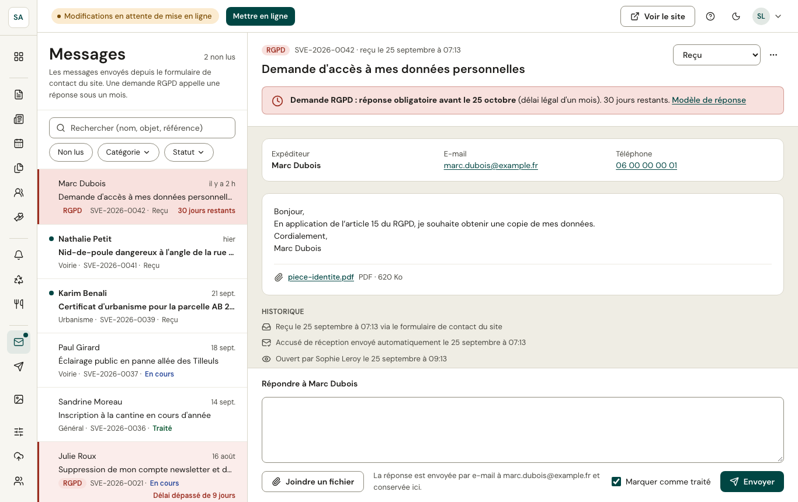

Les messages envoyés depuis le formulaire de contact du site arrivent ici. L'expéditeur reçoit automatiquement un **accusé de réception** avec une référence (`SVE-2026-0042`).

- La liste se filtre : **non lus**, **catégorie**, **statut** (reçu, en cours, traité).
- Le message s'affiche à droite, avec ses pièces jointes et son **historique** (reçu, accusé envoyé, ouvert par…).
- **Répondre** envoie la réponse par e-mail à l'expéditeur et la conserve ici ; **Marquer comme traité** clôt la demande.

## Demandes RGPD

Une demande sur les données personnelles (accès, rectification, effacement) doit recevoir une réponse **sous un mois**. Elle est signalée en rouge avec le **nombre de jours restants**, et un **modèle de réponse** est proposé. Une demande en retard apparaît comme prochaine action sur le tableau de bord.

## Durée de conservation

Les messages **traités** (statut « Traité » ou « Clos ») sont supprimés automatiquement, avec leurs pièces jointes, une fois passée la durée choisie par la commune : 6 mois, 1 an, 2 ans, 3 ans ou jamais. Tant qu'aucune durée n'est choisie, c'est **1 an**. La durée se compte depuis la dernière modification du message ; la suppression a lieu chaque nuit.

- Un message reçu ou en cours n'est **jamais** supprimé automatiquement, ni une demande RGPD avant la fin de son délai d'un mois.
- La durée en vigueur est rappelée en haut de la liste ; **Modifier la durée** mène au réglage (administrateurs), dans [Mentions légales et données personnelles](/mon-site/legal/).
- Chaque nuit où des messages sont supprimés, le [journal d'activité](/administration/journal/) en garde une ligne (« 12 messages traités supprimés »).
