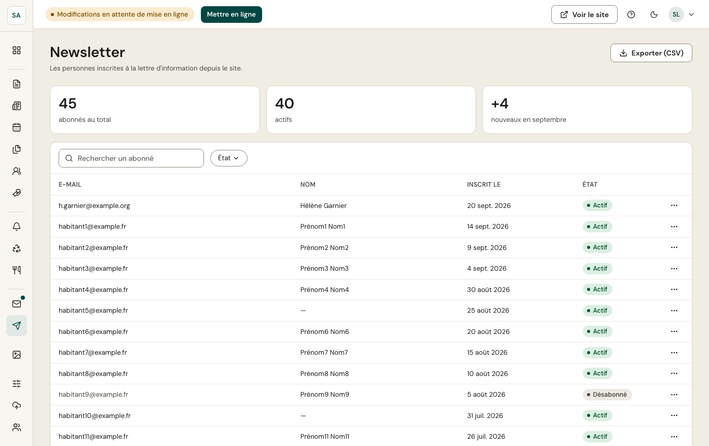

Les habitants s'inscrivent à la lettre d'information depuis le site. L'écran liste les **abonnés** et permet de les **exporter** (fichier CSV) pour votre outil d'envoi.

Une personne qui se désinscrit n'est pas effacée : elle est marquée **désinscrite**, pour ne plus jamais lui écrire par erreur.
