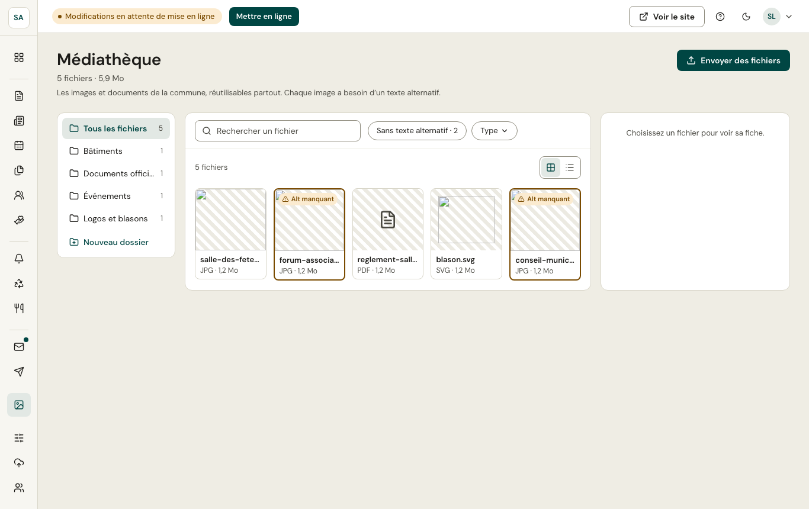

La médiathèque rassemble les images et les fichiers de la commune. Tout fichier ajouté depuis un éditeur y est rangé, et s'y réutilise ensuite.

- Formats acceptés : images, PDF, Word, Excel, OpenDocument ; 20 Mo au plus par fichier.
- Chaque image a un **texte alternatif**, une **légende** et un **crédit**, repris partout où elle est utilisée.
- La fiche d'un fichier indique **où il est utilisé**.

:::tip[Texte alternatif]
Décrivez ce que l'image apporte : « La salle des fêtes décorée pour le repas des aînés », plutôt que « photo ». Une image purement décorative peut être marquée comme telle.
:::
