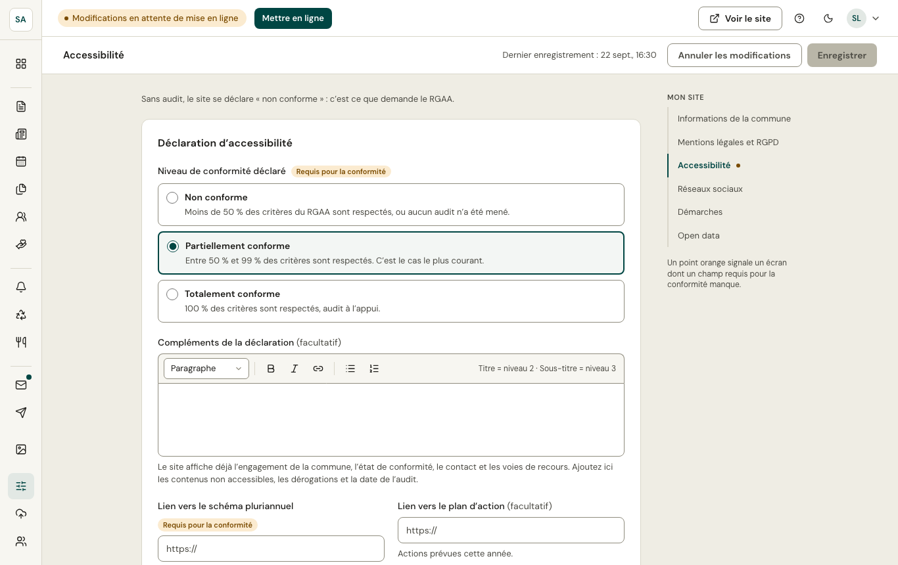

La loi demande à chaque site public une **déclaration d'accessibilité** : l'état de conformité au RGAA, les contenus non accessibles, le schéma pluriannuel, un contact et les voies de recours.

Sans audit, le site se déclare **non conforme** : c'est ce que demande le RGAA. Après un audit, renseignez le **taux de conformité**, la date et l'auditeur ; le statut devient « partiellement conforme » ou « totalement conforme ».

Les thèmes Communeo sont testés en continu (contrastes, navigation au clavier, lecteurs d'écran, affichage à 320 px) ; vos contenus comptent aussi : textes alternatifs, intitulés de liens, PDF balisés.
