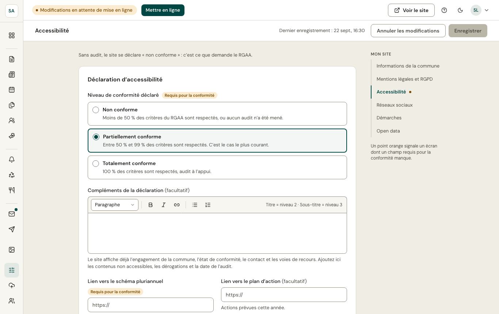

La loi demande à chaque site public une **déclaration d'accessibilité** : l'état de conformité au RGAA, les contenus non accessibles, le schéma pluriannuel, un contact et les voies de recours.

Sans audit, le site se déclare **non conforme** : c'est ce que demande le RGAA. La bulle **Pourquoi « non conforme » ?** l'explique : ce n'est pas un défaut du site, mais la mention imposée tant qu'aucun audit n'a eu lieu. Après un audit, choisissez le niveau obtenu (« partiellement conforme » ou « totalement conforme ») et indiquez la date, l'auditeur et le taux de conformité dans les **compléments de la déclaration**.

Les thèmes Communeo sont testés en continu (contrastes, navigation au clavier, lecteurs d'écran, affichage à 320 px) ; vos contenus comptent aussi : textes alternatifs, intitulés de liens, PDF balisés.
