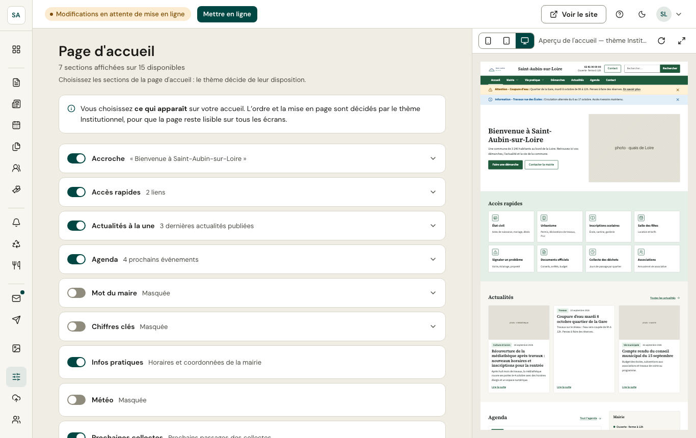

Vous choisissez **ce qui apparaît** sur l'accueil ; le thème décide de l'ordre et de la mise en page, pour que la page reste lisible sur tous les écrans.

Quinze sections peuvent être activées : accroche, accès rapides, actualités à la une, agenda, mot du maire, chiffres clés, infos pratiques, météo, prochaines collectes, perturbations, cantine, associations, partenaires, lettre d'information, texte libre.

Chaque section se déplie pour son contenu (le texte de l'accroche, les liens des accès rapides, le nombre d'actualités…). L'aperçu à droite **met en évidence** la section que vous modifiez.
