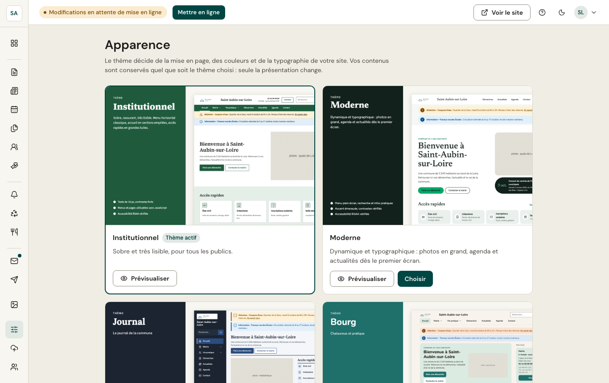

*Réservé aux administrateurs.* Le **thème** décide de la mise en page et du style du site : couleurs, polices, disposition de l'accueil. Quatre thèmes sont proposés :

- **Institutionnel** : sobre et très lisible, pour tous les publics.
- **Moderne** : dynamique et typographique, photos en grand.
- **Journal** : le journal de la commune, navigation en barre latérale, rubriques en colonnes.
- **Bourg** : chaleureux et pratique, mairie, alertes, collectes et météo toujours à portée de main.

**Prévisualiser** montre **votre** site dans le thème, en plein écran, en ordinateur, tablette ou téléphone. **Choisir** change le thème, après confirmation, et peut lancer la mise en ligne tout de suite. Vos contenus sont conservés : seule la présentation change.

:::note
Les couleurs et les polices ne se règlent pas : elles font partie du thème, et leurs contrastes sont vérifiés pour l'accessibilité. L'identité de la commune tient à son nom et à son logo, modifiables dans [Informations de la commune](/mon-site/informations/).
:::
