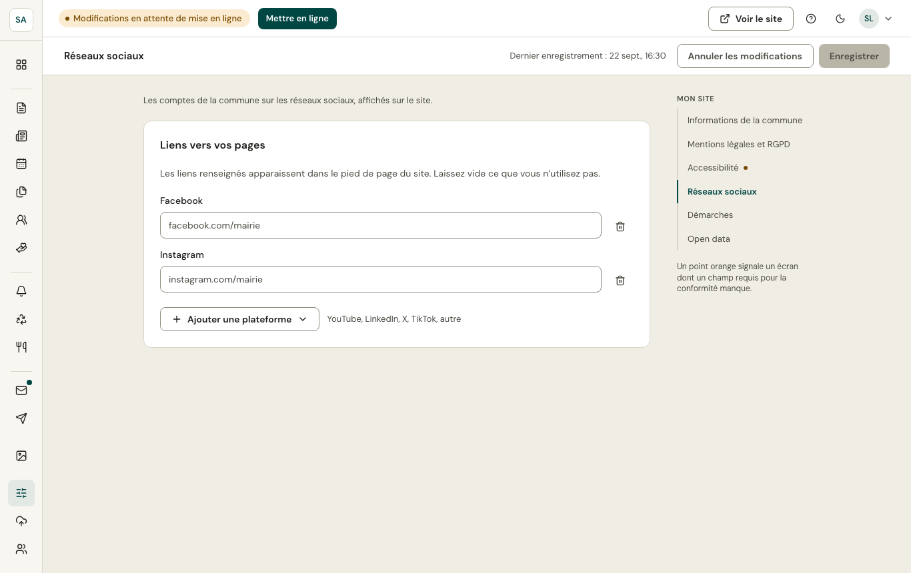
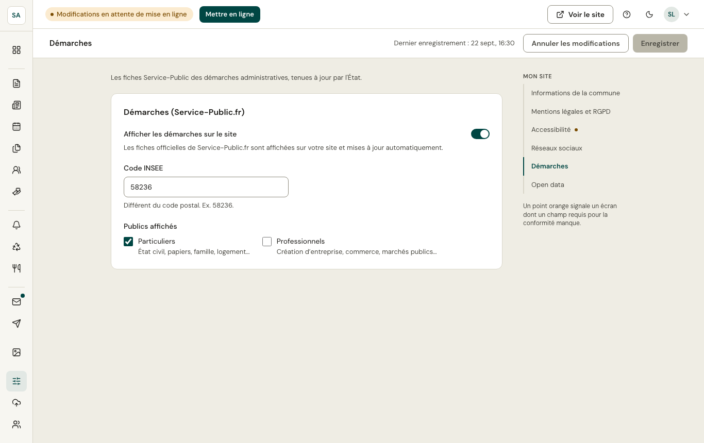
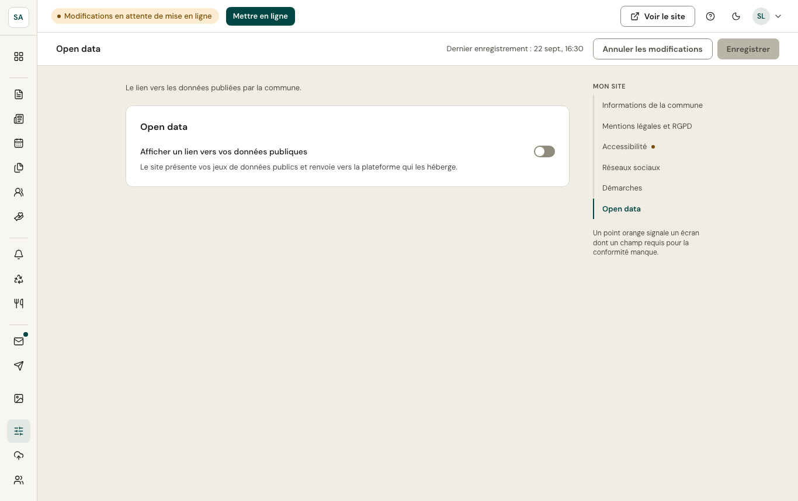

## Réseaux sociaux

Les comptes de la commune (Facebook, Instagram…), affichés dans le pied de page du site.

## Démarches

Le site affiche les **fiches Service-Public** des démarches administratives (carte d'identité, état civil, urbanisme…), tenues à jour par l'État. Vous choisissez les thèmes proposés, et pouvez ajouter des précisions locales (où déposer un dossier en mairie).

## Open data

Le lien vers les données publiées par la commune (data.gouv.fr ou portail local), affiché sur le site.
