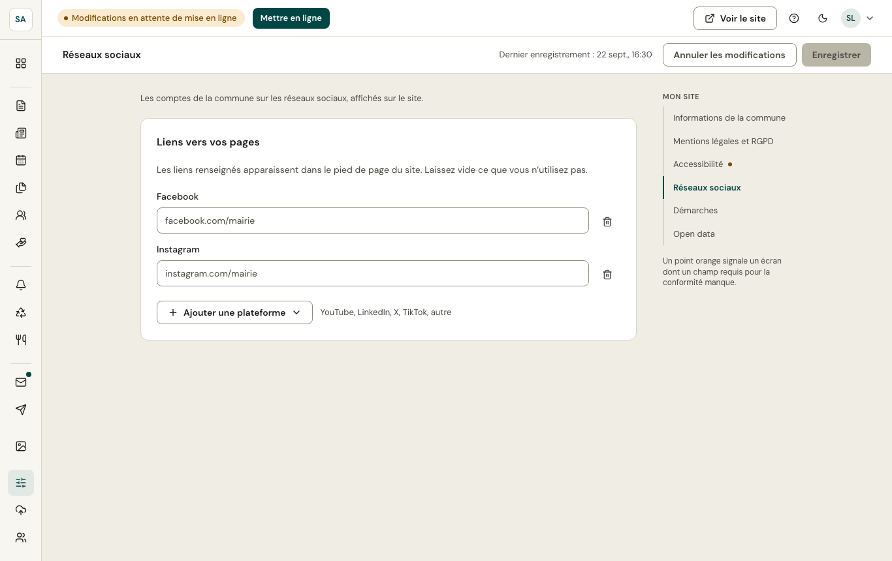
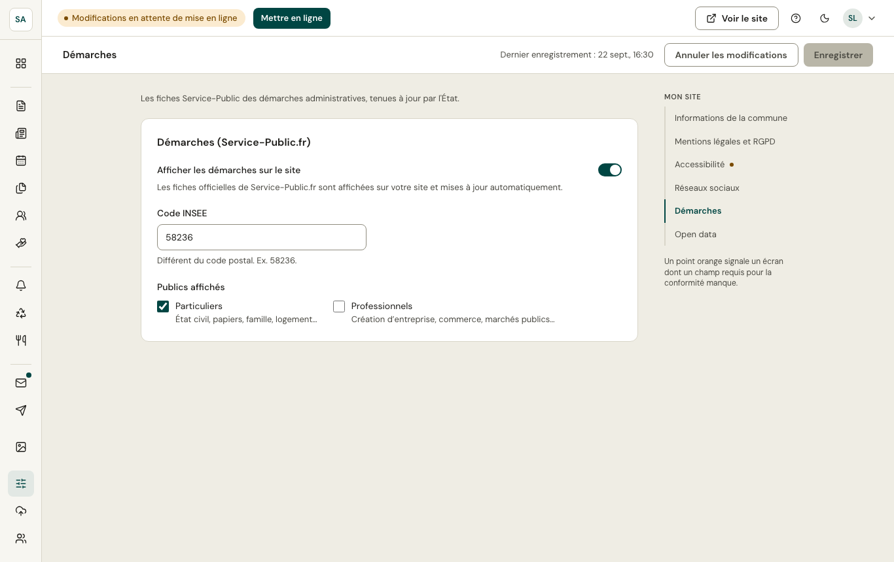
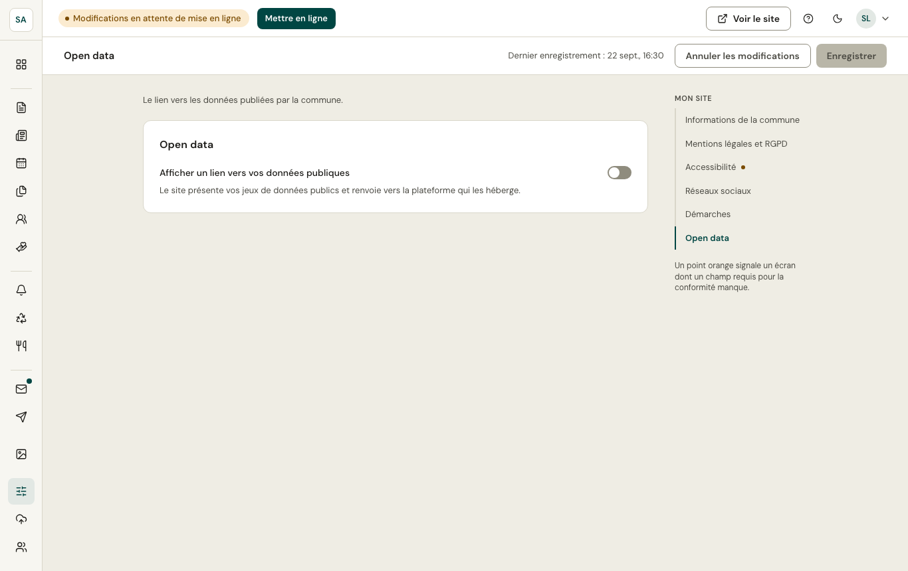

## Réseaux sociaux

Les comptes de la commune (Facebook, Instagram…), affichés dans le pied de page du site.

## Démarches

Le site affiche les **fiches Service-Public** des démarches administratives (carte d'identité, état civil, urbanisme…), tenues à jour par l'État. Les habitants peuvent **rechercher parmi toutes les démarches** (plus de 3 000 fiches) depuis la page Démarches ou la recherche du site, ou les parcourir par thème ; quand une fiche indique de s'adresser à la mairie, le lien mène à la page Contact de votre site. Vous choisissez les thèmes proposés, et pouvez ajouter des précisions locales (où déposer un dossier en mairie).

## Open data

Le lien vers les données publiées par la commune (data.gouv.fr ou portail local), affiché sur le site.
