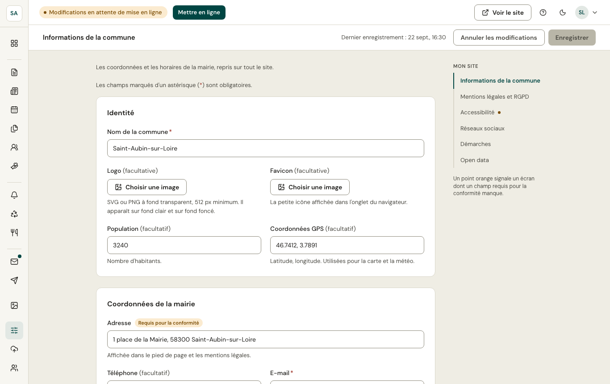

Ces informations sont reprises sur tout le site : en-tête, pied de page, page Contact, statut « Ouverte / Fermée » calculé à l'heure du visiteur.

- **Nom**, **logo** (ou blason), **favicon**.
- **Adresse**, **téléphone**, **e-mail**, **coordonnées GPS** (carte et météo).
- **Horaires d'ouverture**, jour par jour, et les **fermetures exceptionnelles** (sur une date ou une période).
