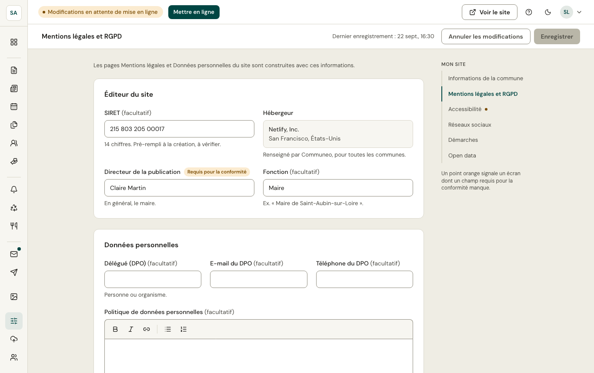

Les pages **Mentions légales** et **Données personnelles** du site sont construites avec ces informations : directeur de la publication, SIRET, délégué à la protection des données, durées de conservation, crédits…

L'**hébergeur** du site est renseigné par la plateforme et ne se modifie pas.

## Conservation des messages

« Supprimer automatiquement les messages traités après… » : **6 mois**, **1 an**, **2 ans**, **3 ans** ou **jamais**. Sans choix, les messages traités sont supprimés au bout d'**1 an**. La durée choisie apparaît sur la page **Données personnelles** du site, et l'écran [Conformité](/administration/conformite/) vérifie qu'elle a été choisie.

La correspondance d'une mairie peut relever des **archives publiques** (Code du patrimoine) : la suppression est un choix de la commune. Choisissez « jamais » si les messages doivent être gardés, par exemple à la demande des Archives départementales ; ils se suppriment alors un par un dans l'écran [Messages](/habitants/messages/).

Ce réglage est réservé aux administrateurs.
