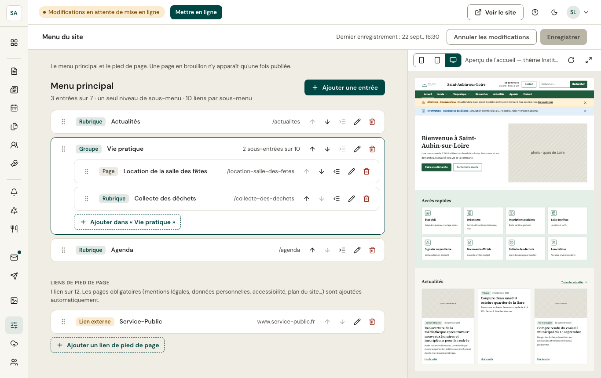

Le **menu principal** se compose de rubriques (un lien) et de **groupes** (un intitulé qui déplie plusieurs pages, par exemple « Vie pratique »). Le **pied de page** reçoit des liens utiles (communauté de communes, open data…).

- Ajoutez une page, un lien vers un autre site ou un groupe ; réordonnez avec les flèches ou en glissant.
- Une page en brouillon n'apparaît dans le menu qu'une fois publiée.
- L'aperçu à droite montre le menu non enregistré dans le thème du site.
