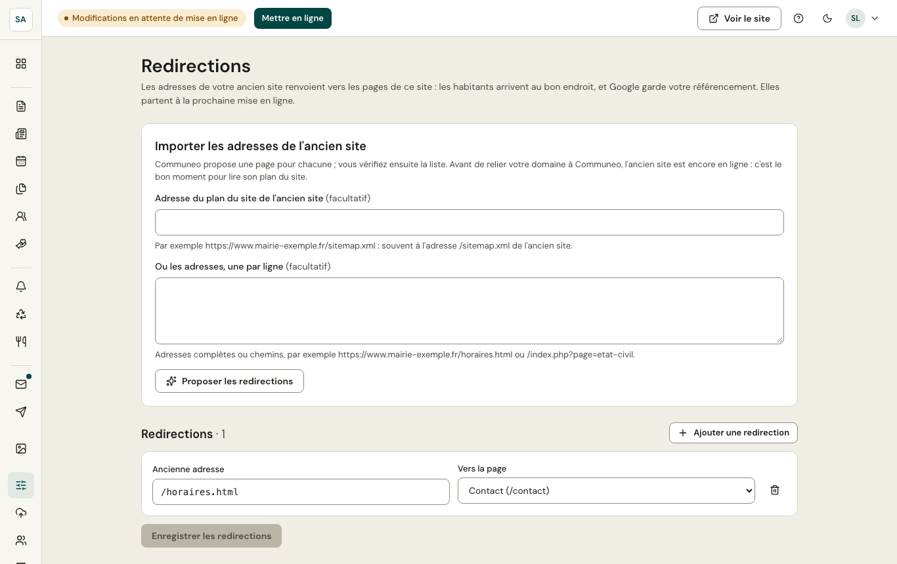

Votre commune avait déjà un site sur son domaine ? Google connaît ses pages (`/horaires.html`, `/index.php?page=etat-civil`…). Quand le domaine est relié à Communeo, ces anciennes adresses n'existent plus : sans redirection, les habitants tombent sur une page introuvable et le site perd sa place dans Google.

L'écran **Mon site › Redirections** (administrateurs) fait renvoyer chaque ancienne adresse vers la bonne page du nouveau site. Les habitants arrivent au bon endroit, et Google transfère le référencement acquis.

## Préparer les redirections

Faites-le **avant de relier votre domaine** : l'ancien site est encore en ligne.

1. Dans **Importer les adresses de l'ancien site**, indiquez l'adresse de son **plan du site** (souvent `https://www.votre-commune.fr/sitemap.xml`), ou collez ses adresses, une par ligne.
2. **Proposer les redirections** : Communeo propose une page pour chaque adresse, d'après son titre ou les mots de l'adresse (horaires → Contact, comptes rendus → Documents officiels…).
3. Vérifiez la liste. **À vérifier** : la proposition est probable, pas certaine. **À choisir** : rien ne ressemble, choisissez une page ou retirez la ligne. **Seulement celles à vérifier** filtre la liste.
4. **Enregistrer les redirections** : elles partent à la prochaine mise en ligne.

Vous pouvez aussi **ajouter une redirection** à la main, ou en retirer une. La page d'accueil n'a pas besoin de redirection.
