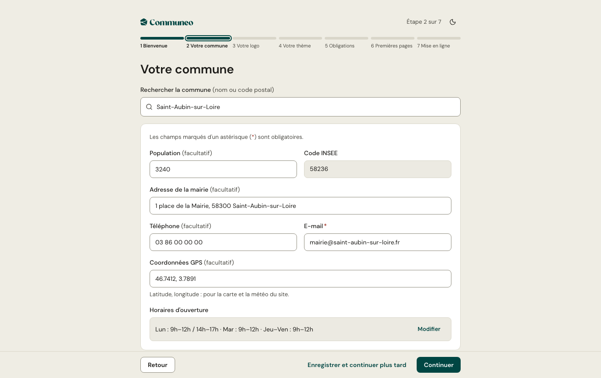

À la création d'une commune, l'administrateur est accueilli par un **assistant en sept étapes**. Chaque étape peut être reprise plus tard : **Enregistrer et continuer plus tard** conserve ce qui est saisi, et le tableau de bord propose de reprendre.

1. **Bienvenue** : ce que l'assistant va préparer.
2. **Votre commune** : recherche de la commune par nom ou code postal ; population, adresse, téléphone, coordonnées GPS et horaires sont proposés depuis les données publiques, à vérifier.
3. **Votre logo** : le logo ou le blason de la commune.
4. **Votre thème** : chaque vignette montre votre commune dans le thème ; un aperçu plein écran permet de comparer. Voir [Apparence](/mon-site/apparence/).
5. **Obligations** : mentions légales, données personnelles et déclaration d'accessibilité, pré-remplies à partir des informations déjà saisies.
6. **Premières pages** : des modèles de pages (état civil, urbanisme, salle des fêtes…) créés en brouillon, à compléter.
7. **Mise en ligne** : la première publication du site.

Après l'assistant, une **liste de démarrage** reste sur le tableau de bord tant qu'elle n'est pas terminée ou masquée.
