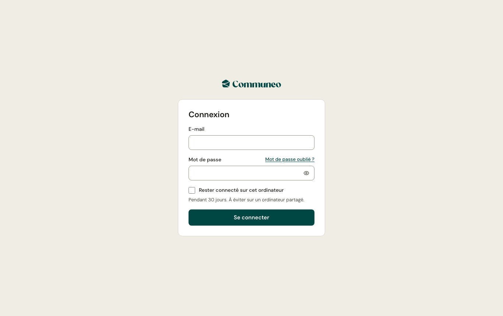

1. Ouvrez l'adresse de l'administration communiquée par l'équipe Communeo.
2. Saisissez votre **e-mail** et votre **mot de passe**, puis **Se connecter**.

La session reste ouverte pendant votre travail ; après plusieurs heures sans activité, l'administration vous demande de vous reconnecter. Vos saisies en cours ne sont pas perdues : l'éditeur enregistre automatiquement.

## Première connexion

Vous recevez une **invitation** par e-mail. Le lien vous fait choisir votre mot de passe (10 caractères au moins), puis vous connecte.

## Mot de passe oublié

Sur l'écran de connexion, **Mot de passe oublié** envoie un lien de réinitialisation à votre adresse. Le lien a une durée de validité limitée.

:::caution
Après plusieurs essais de connexion infructueux, l'accès est bloqué quelques minutes, pour protéger votre compte.
:::
