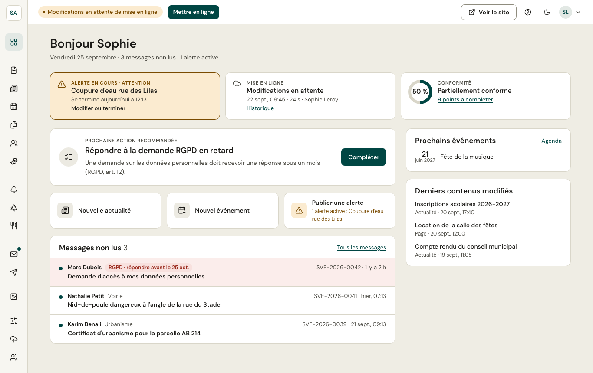
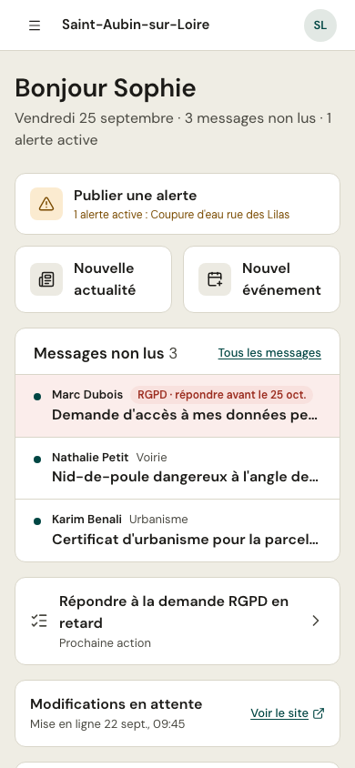

Le tableau de bord rassemble ce qui compte maintenant :

- **Alerte en cours** : l'alerte affichée sur le site, avec un lien pour la modifier ou la terminer.
- **Mise en ligne** : l'état du site (à jour, modifications en attente, mise en ligne en cours ou en échec) et l'historique.
- **Conformité** : le pourcentage des obligations remplies et les points à compléter.
- **Prochaine action recommandée** : la tâche la plus utile du moment (une demande RGPD en retard, une alerte, un contenu à terminer…).
- **Raccourcis** : nouvelle actualité, nouvel événement, publier une alerte.
- **Messages non lus**, **prochains événements** et **derniers contenus modifiés**.

## En haut de chaque écran

- La **pastille d'état** du site (« Modifications en attente de mise en ligne »…) et le bouton **Mettre en ligne**.
- **Voir le site** ouvre le site public dans un nouvel onglet.
- L'aide (**?**), le **mode sombre**, et le menu de votre compte.

## Sur téléphone

Le menu s'ouvre avec le bouton en haut à gauche. Les raccourcis les plus utiles passent en premier.
