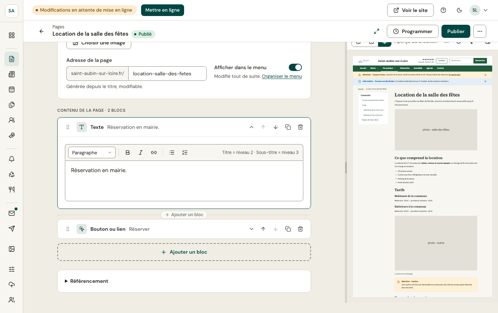
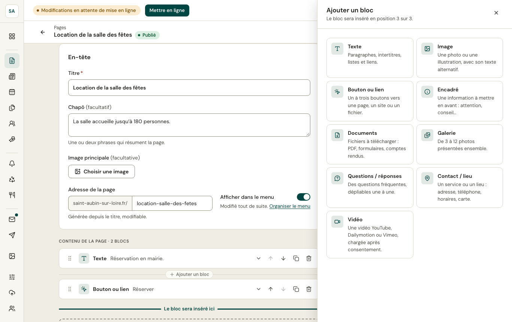

Le contenu d'une page, d'une actualité ou d'un événement se compose de **blocs** : un paragraphe, une image, des boutons… Le thème du site décide de leur présentation ; vous choisissez leur ordre et leur contenu.

## Ajouter un bloc

**Ajouter un bloc** (en fin de liste, ou entre deux blocs) ouvre le catalogue :

| Bloc | Pour |
|---|---|
| **Texte** | Paragraphes, intertitres, listes et liens. |
| **Image** | Une photo ou une illustration, avec son texte alternatif. |
| **Bouton ou lien** | Un à trois boutons vers une page, un site ou un fichier. |
| **Encadré** | Une information à mettre en avant : attention, conseil… |
| **Documents** | Des fichiers à télécharger : PDF, formulaires, comptes rendus. |
| **Galerie** | De 3 à 12 photos présentées ensemble. |
| **Questions / réponses** | Des questions fréquentes, dépliables une à une. |
| **Contact / lieu** | Un service ou un lieu : adresse, téléphone, horaires, carte. |
| **Vidéo** | Une vidéo YouTube, Dailymotion ou Vimeo, chargée après consentement. |

## Modifier, déplacer, supprimer

Chaque bloc se replie et se déplie en cliquant sur son titre. Les boutons à droite le **déplacent** (vers le haut, vers le bas), le **dupliquent** ou le **suppriment** ; la poignée à gauche permet aussi de le glisser. Tout se fait aussi au clavier.

## Le texte

La barre d'outils propose les **intertitres** (Titre = niveau 2, Sous-titre = niveau 3), le **gras**, l'**italique**, les **liens** et les **listes**. Les intertitres forment le sommaire des pages longues.

:::tip[Accessibilité]
- Chaque image a besoin d'un **texte alternatif** qui dit ce qu'elle montre (sauf si elle est purement décorative).
- Préférez un intertitre à un texte en gras pour découper un contenu.
- Un lien dit où il mène : « Tarifs de la salle », plutôt que « cliquez ici ».

La publication vérifie les blocs : un champ obligatoire vide ou une image sans texte alternatif empêche de publier, avec un récapitulatif des corrections à faire.
:::
