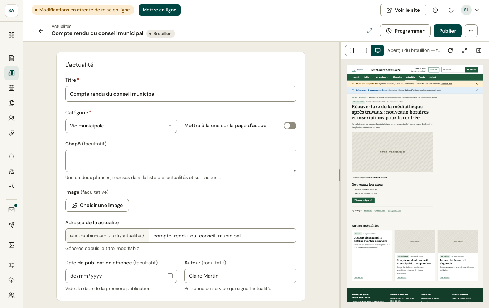

Pages, actualités et événements s'écrivent dans le même éditeur.

## Le formulaire

- En tête, les **informations** du contenu : titre, chapô (une ou deux phrases de résumé), image principale, adresse de la page (générée depuis le titre, modifiable)… Les champs obligatoires sont marqués d'un astérisque.
- Ensuite, le **contenu** en [blocs](/publier/blocs/).
- En bas, le **référencement** (titre et description pour les moteurs de recherche), facultatif.

L'éditeur **enregistre automatiquement** le brouillon quelques secondes après chaque saisie. Rien n'est visible sur le site tant que vous n'avez pas publié.

## L'aperçu

Le panneau de droite montre le **brouillon dans le thème du site**, comme il apparaîtra une fois publié : en ordinateur, tablette ou téléphone, et en plein écran. Il se replie avec le bouton à son angle.

## En haut de l'éditeur

- La flèche revient à la liste.
- Le **statut** : Brouillon, Publié, ou Modifié (la version en ligne diffère du brouillon).
- **Programmer**, **Publier** : voir [Publier, programmer, historique](/publier/publication/).
- **⋯** : voir sur le site, [historique](/publier/publication/#historique), supprimer.
