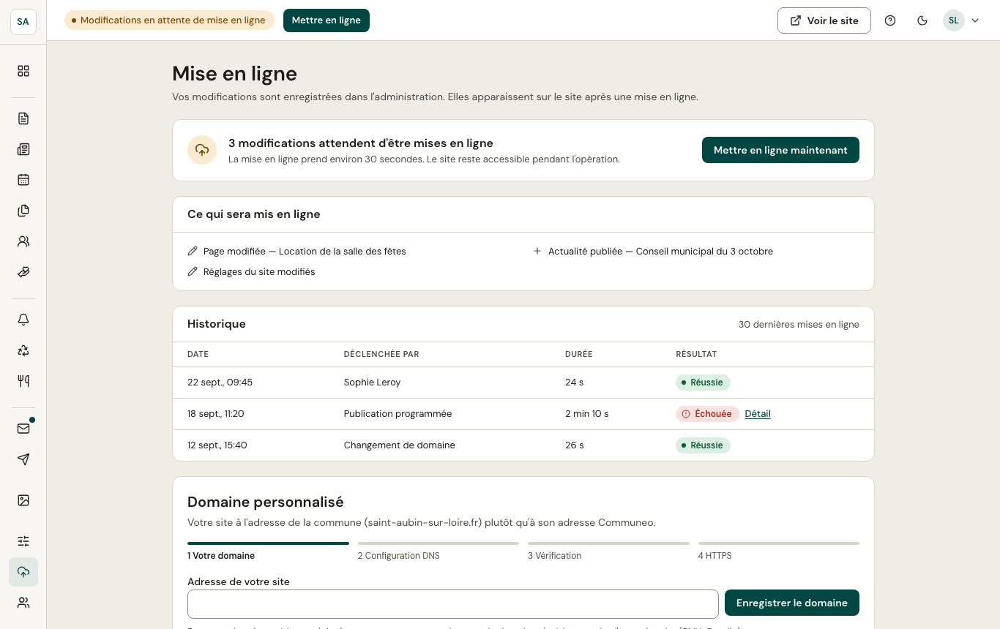

Vos changements sont enregistrés dans l'administration ; ils apparaissent sur le site public après une **mise en ligne**, qui reconstruit le site en une trentaine de secondes. Le site reste accessible pendant l'opération.

## Automatique ou immédiate

- **Automatique** : peu après votre dernier changement publié, la mise en ligne se lance d'elle-même.
- **Immédiate** : le bouton **Mettre en ligne** (en haut de chaque écran, ou **Mettre en ligne maintenant** ici) la lance tout de suite.

L'écran liste **ce qui sera mis en ligne** (contenus publiés, modifiés, réglages du site) et l'**historique** des dernières mises en ligne : qui l'a déclenchée, sa durée, son résultat. En cas d'échec, **Détail** donne la référence à communiquer à l'équipe Communeo ; vos changements restent en attente.

## Domaine personnalisé

*Réservé aux administrateurs.* Le site peut être servi à l'adresse de la commune (par exemple `saint-aubin-sur-loire.fr`) plutôt qu'à son adresse Communeo :

1. **Votre domaine** : saisissez l'adresse.
2. **Configuration DNS** : l'écran indique les enregistrements à créer chez votre registraire (OVH, Gandi…).
3. **Vérification** : l'écran compare ce qui est attendu et ce qui est trouvé.
4. **HTTPS** : le certificat est installé automatiquement une fois le domaine vérifié.

L'adresse Communeo continue de fonctionner : elle renvoie vers le domaine de la commune.

:::note[Pendant l'essai]
Le domaine personnalisé est disponible une fois le site [passé en live](/premiers-pas/essai/).
:::
