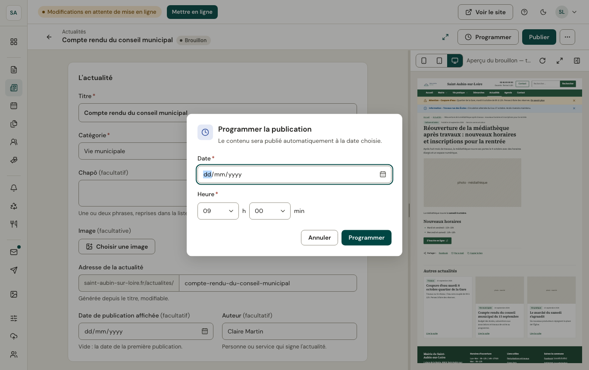
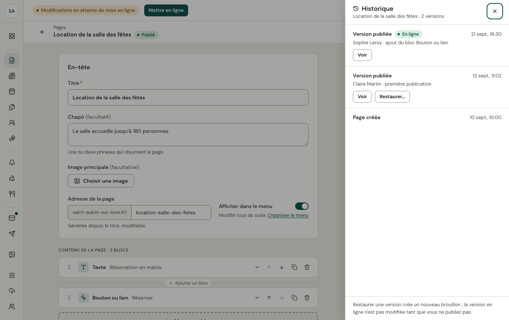

## Publier

**Publier** rend le brouillon public : il fait partie du site à la prochaine [mise en ligne](/publier/mise-en-ligne/). Si des informations manquent, un récapitulatif liste les champs à corriger, avec un lien vers chacun.

Un contenu déjà publié que vous modifiez passe au statut **Modifié** : la version en ligne reste en place tant que vous ne publiez pas à nouveau.

## Programmer

**Programmer** choisit la date et l'heure de publication (heure de Paris, au quart d'heure). Le contenu est publié automatiquement à ce moment, puis mis en ligne.

## Dépublier, supprimer

Depuis la liste (menu **⋯** d'une ligne) : **Dépublier** retire le contenu du site en gardant le brouillon ; **Supprimer** l'efface, après confirmation.

## Historique

Le menu **⋯** de l'éditeur ouvre l'**historique** : chaque version publiée, avec son auteur et ce qui a changé. **Voir** affiche une version ; **Restaurer** la reprend dans le brouillon. La version en ligne ne change pas tant que vous ne publiez pas.
