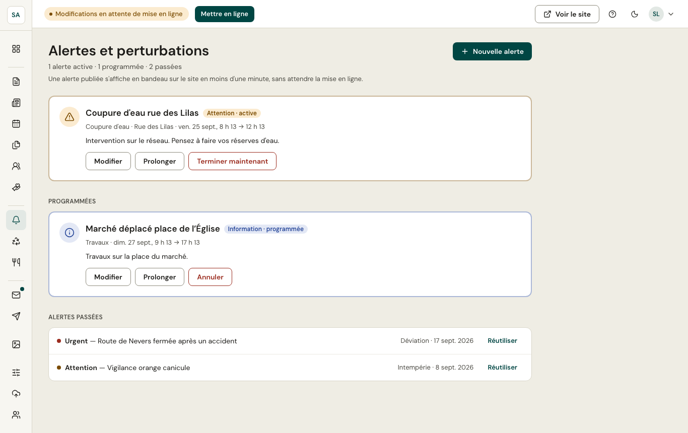
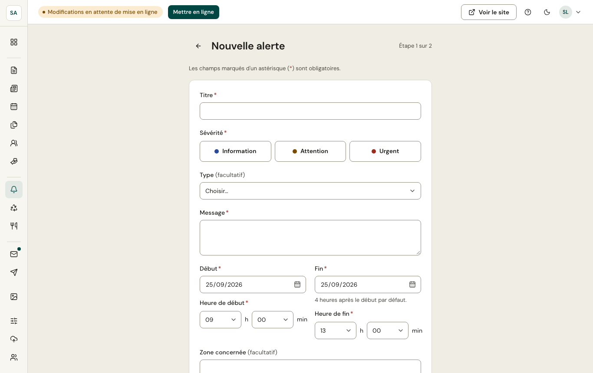

Une alerte s'affiche **en bandeau en haut de toutes les pages** du site, en moins d'une minute, sans attendre la mise en ligne : coupure d'eau, travaux, intempéries…

## Publier une alerte

1. **Titre**, **sévérité** et **message**. La sévérité change la couleur et le signe du bandeau :
   - **Information** : un renseignement utile (travaux, déviation) ;
   - **Attention** : une gêne à prévoir (coupure d'eau) ;
   - **Urgent** : un danger ou une consigne de sécurité ; ce bandeau ne peut pas être fermé par les visiteurs.
2. **Début** et **fin** (4 heures après le début par défaut), et la **zone concernée**.
3. Un **lien** facultatif vers une page ou un site pour en savoir plus.
4. À l'étape 2, l'aperçu du bandeau, puis **Publier**.

L'alerte disparaît d'elle-même à la date de fin. Le tableau de bord permet aussi de la **modifier ou la terminer** plus tôt.
