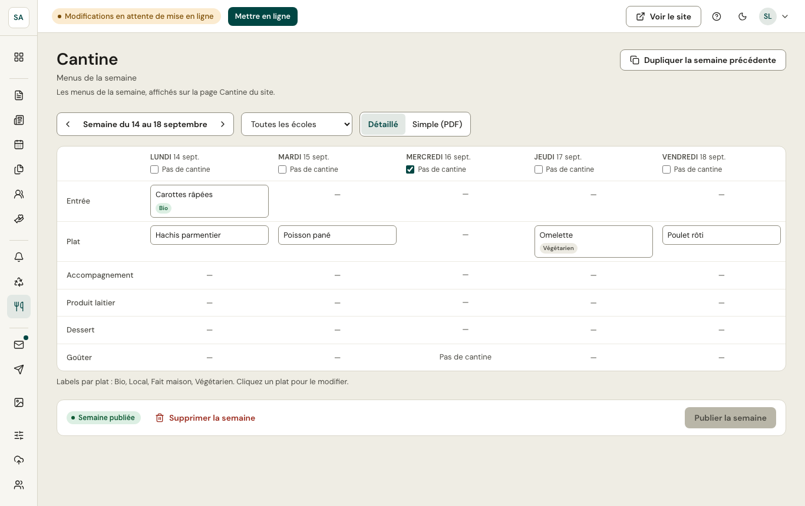

Les menus se saisissent **semaine par semaine** (flèches pour changer de semaine) et, si besoin, **école par école**.

- **Détaillé** : un tableau jour par jour (entrée, plat, accompagnement, produit laitier, dessert, goûter). Cliquez un plat pour le modifier et lui ajouter ses **labels** (Bio, Local, Fait maison, Végétarien). Cochez **Pas de cantine** pour un jour férié ou une sortie.
- **Simple (PDF)** : une image ou un PDF du menu, si le prestataire le fournit ainsi.

**Dupliquer la semaine précédente** reprend les menus pour gagner du temps. **Publier la semaine** les rend visibles sur le site à la prochaine mise en ligne.
