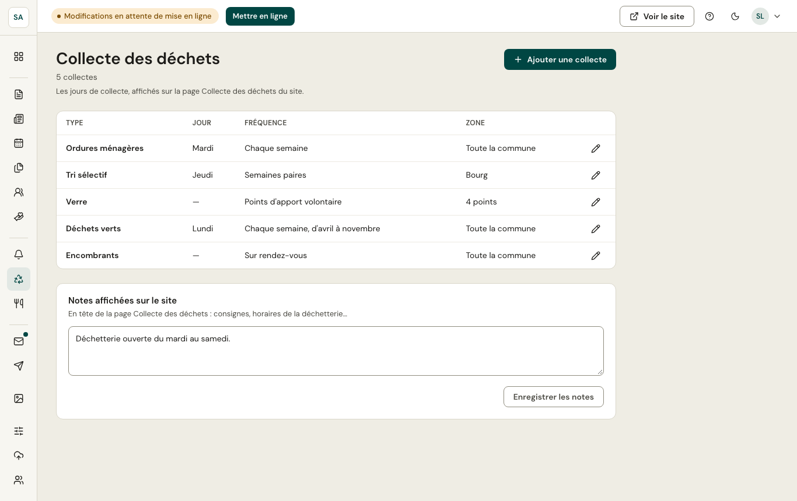

Chaque collecte (ordures ménagères, tri sélectif, verre, déchets verts, encombrants…) a :

- un **jour** et une **fréquence** : chaque semaine, semaines paires ou impaires, une fois par mois (1er, 2e… jour du mois), sur rendez-vous, apport volontaire ;
- une **saison** si elle ne fonctionne qu'une partie de l'année (déchets verts d'avril à novembre) ;
- une **zone** (toute la commune ou un quartier) et une **note** (« Sortir les bacs la veille »).

Le site calcule les **prochains passages** et les affiche sur la page Collecte des déchets, et sur l'accueil si la section est activée. Une note générale (horaires de la déchetterie…) se saisit en haut de l'écran.
